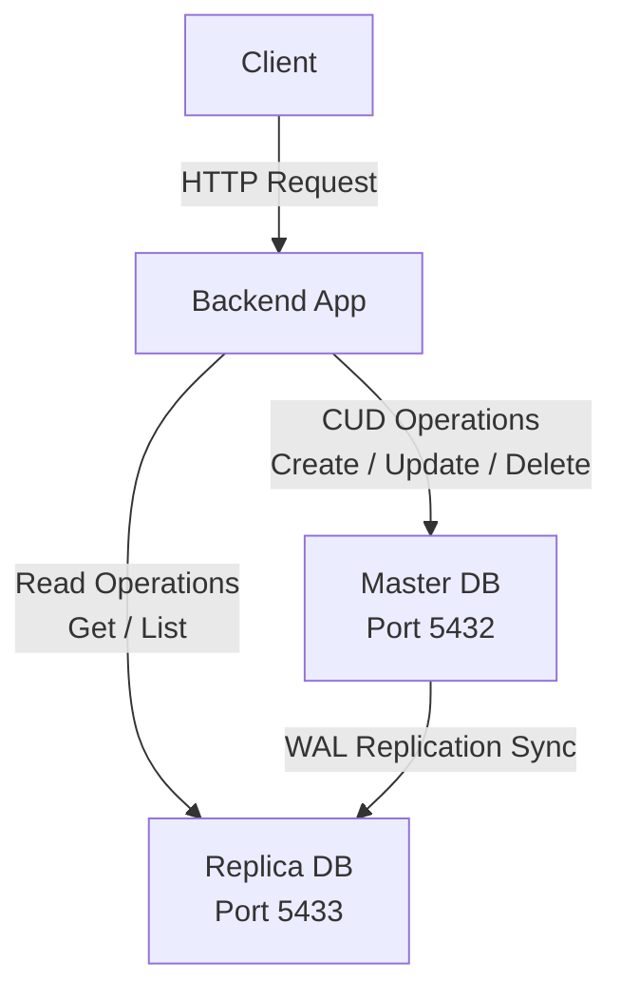

# Employee Management System

A simple Employee Management System built with Python, Flask, and SQLAlchemy using a layered architecture (Controller → Service → Repository). Uses PostgreSQL as the database.

## Project Structure

```
Backend/
├── app.py                            # Application entry point (runs server or tests)
├── Dockerfile                        # Container image for Flask app (Python 3.10)
├── .dockerignore                     # Files excluded from Docker build
├── docker-compose.yml                # Docker setup for Master, Replica & Test databases
├── requirements.txt                  # Python dependencies
├── .env.example                      # Sample environment variables
├── .gitignore                        # Git ignore rules
├── core/
│   ├── config.py                     # Configuration loader (reads from .env)
│   ├── db.py                         # Master & Replica session connection setup
│   └── logger.py                     # Structured logging configuration
├── utils/
│   └── constants.py                  # APIError exception, HTTP status codes & strings
├── models/
│   └── employee_model.py             # SQLAlchemy Database Model for Employees
├── dtos/
│   ├── request/
│   │   └── employee_request.py       # Pydantic Request validation DTOs
│   └── response/
│       └── employee_response.py      # Pydantic Response formatting DTOs
├── controllers/
│   └── employee_controller.py        # Controller Layer (HTTP routes & DTO matching)
├── services/
│   └── employee_service.py           # Service Layer (Business logic & domain checks)
├── repositories/
│   └── employee_repository.py        # Repository Layer (Direct database queries)
├── migrations/
│   ├── 1717334640_initial_up.sql      # Main schema setup migration (creates table)
│   ├── 1717334640_initial_down.sql    # Main schema teardown migration (drops table)
│   └── README.md                     # Migration execution documentation
├── docker/
│   └── postgres/
│       ├── create-replication-user.sh # Runs on Master (creates replicator user/slot)
│       └── setup-replica.sh          # Runs on Replica (clones Master and sets standby)
└── tests/
    ├── test_runner.py                # Automated migration-based integration test runner
    └── migrations/
        ├── test_up.sql               # Creates employees table in test database
        ├── test_seed.sql             # Seeds 5 dummy records with static UUIDs for tests
        └── test_down.sql             # Teardown test schema (drops table)
```

## Architecture & Data Flow




### Architectural Capabilities

#### 1. Functional Architecture

| Feature | Implementation | Purpose |
| :--- | :--- | :--- |
| **Clean Layers** | Controller → Service → Repository | Splits HTTP routing, business logic, and SQL queries into separate files. |
| **Input Validation** | Pydantic DTOs | Rejects bad requests (short names, invalid emails) before running logic. |
| **Secure IDs** | UUID v4 | Uses UUIDs instead of integers to hide raw counts. Rejects invalid formats with 400. |
| **Easy Errors** | `APIError` Class | Let services raise exceptions with HTTP codes, keeping controllers simple. |

#### 2. Non-Functional Architecture

| Attribute | Implementation | Benefit |
| :--- | :--- | :--- |
| **Read-Write Split** | Write → Master, Read → Replica | Sends reads to replica and writes to master to handle more traffic. |
| **Database Sync** | WAL Streaming Slot | Syncs master changes to the replica in milliseconds. |
| **Logs Rotation** | Rotating File Handler | Caps log file to 10MB to prevent server disk from filling up. |
| **Separate Testing** | Isolated DB ports (5434 / 5435) | Keeps testing data completely away from production databases. |


## Setup Instructions

You can run this project either completely using Docker, or by running the backend locally while using Docker only for the databases.

### Option A: Fully Containerized (Recommended)

Only **Docker Desktop** is needed. No Python or PostgreSQL installation required.

1. **Clone and Start**
   ```bash
   git clone https://github.com/yashjaiswal5859/Employee_Assignment.git
   cd Backend
   docker compose up -d
   ```
   This spins up all 5 containers (Master DB, Replica DB, Test Master, Test Replica, and the Flask Backend).

2. **Access the API**
   The API is live at `http://localhost:5000`.

3. **Stop Everything**
   ```bash
   docker compose down
   ```

### Option B: Run Backend Locally (Without Docker for Backend)

Requires **Python 3.10+** and **Docker Desktop** (for the databases).

1. **Clone the Repository**
   ```bash
   git clone https://github.com/yashjaiswal5859/Employee_Assignment.git
   cd Backend
   ```

2. **Start the Databases**
   We still use Docker to quickly spin up the Master and Replica Postgres databases.
   ```bash
   # Start only the database containers, skip the backend container
   docker compose up -d postgres_master postgres_replica postgres_test_master postgres_test_replica
   ```

3. **Set Up Python Environment**
   ```bash
   python -m venv venv
   
   # Windows
   venv\Scripts\activate
   # macOS/Linux
   source venv/bin/activate
   
   pip install -r requirements.txt
   ```

4. **Configure Environment Variables**
   ```bash
   cp .env.example .env
   ```
   *(Note: The defaults in `.env.example` already use `localhost:5432` and `localhost:5433` for DB connections, which is correct for local development).*

5. **Run the Flask App**
   ```bash
   python app.py
   ```
   The API will be available at `http://localhost:5000`.

---

### Environment Variables

If using Option A (Docker), everything is pre-configured inside `docker-compose.yml`. If using Option B (Local), they are read from `.env`.

| Variable | Description | Reason for Use |
|----------|-------------|----------------|
| `PORT` | Flask application port | Configures the port that the Flask server runs on (defaults to 5000). |
| `MASTER_DATABASE_URL` | Primary DB connection string | Used for all write operations (CREATE, UPDATE, DELETE). |
| `REPLICA_DATABASE_URL` | Read-only DB connection string | Used for all read operations (GET) to offload traffic from the master. |
| `TEST_MASTER_DATABASE_URL` | Test primary connection | Used by the test suite to test writes without touching real data. |
| `TEST_REPLICA_DATABASE_URL` | Test read-only connection | Used by the test suite to verify reads during tests. |
| `REPLICATION_USER` | Replication username | Used by the replica to authenticate with the master for WAL streaming. |
| `REPLICATION_PASSWORD` | Replication password | Password for the replication user on the master. |
| `TEST_REPLICATION_USER` | Test replication username | Same as above but for the test replica container. |
| `TEST_REPLICATION_PASSWORD` | Test replication password | Same as above but for the test replica container. |
| `REPLICATION_SLOT` | WAL replication slot name | Named slot on master that tracks which WAL data the replica has received. |
| `TEST_REPLICATION_SLOT` | Test replication slot name | Same as above but for the test database pair. |

---

## API Endpoints

### 1. Create Employee
**POST** `/employees`

Creates a new employee. Incoming data is strictly validated.

**Request Body:**
```json
{
    "name": "John Doe",
    "email": "john.doe@example.com",
    "department": "Engineering",
    "date_joined": "2024-01-15"
}
```

**✅ Success Response (`201 Created`):**
```json
{
    "id": "9b1deb4d-3b7d-4bad-9bdd-2b0d7b3dcb6d",
    "name": "John Doe",
    "email": "john.doe@example.com",
    "department": "Engineering",
    "date_joined": "2024-01-15"
}
```

**❌ Failure Response (`400 Bad Request` - Validation Error):**
Happens if the payload is invalid (e.g. name too short, bad email format, future date).
```json
{
    "error": "Validation Error",
    "details": [
        {
            "loc": ["name"],
            "msg": "String should have at least 2 characters",
            "type": "string_too_short"
        }
    ]
}
```

**❌ Failure Response (`409 Conflict` - Duplicate Email):**
Happens if the email already belongs to another employee.
```json
{
    "error": "Employee with email john.doe@example.com already exists"
}
```

---

### 2. Get All Employees
**GET** `/employees`

Retrieves a list of all employees. This read operation goes directly to the **Replica Database**.

**✅ Success Response (`200 OK`):**
```json
[
    {
        "id": "11111111-1111-1111-1111-111111111111",
        "name": "John Doe",
        "email": "john.doe@example.com",
        "department": "Engineering",
        "date_joined": "2024-01-15"
    },
    {
        "id": "22222222-2222-2222-2222-222222222222",
        "name": "Jane Smith",
        "email": "jane.smith@example.com",
        "department": "Marketing",
        "date_joined": "2024-02-01"
    }
]
```
*(Returns an empty array `[]` if there are no employees).*

---

### 3. Get Employee by ID
**GET** `/employees/{id}`

Retrieves a single employee. This read operation goes directly to the **Replica Database**.

**✅ Success Response (`200 OK`):**
```json
{
    "id": "11111111-1111-1111-1111-111111111111",
    "name": "John Doe",
    "email": "john.doe@example.com",
    "department": "Engineering",
    "date_joined": "2024-01-15"
}
```

**❌ Failure Response (`400 Bad Request` - Invalid ID Format):**
Happens if the provided ID is not a valid UUID format.
```json
{
    "error": "Invalid employee ID format"
}
```

**❌ Failure Response (`404 Not Found`):**
Happens if the ID does not exist in the database.
```json
{
    "error": "Employee with ID 99999999-9999-9999-9999-999999999999 not found"
}
```

---

### 4. Update Employee
**PUT** `/employees/{id}`

Updates an existing employee. Only fields provided in the payload will be updated.

**Request Body (All fields optional):**
```json
{
    "name": "John Updated",
    "department": "Management"
}
```

**✅ Success Response (`200 OK`):**
```json
{
    "id": "11111111-1111-1111-1111-111111111111",
    "name": "John Updated",
    "email": "john.doe@example.com",
    "department": "Management",
    "date_joined": "2024-01-15"
}
```

**❌ Failure Response (`404 Not Found`):**
Happens if you try to update an ID that does not exist.
```json
{
    "error": "Employee with ID 99999999-9999-9999-9999-999999999999 not found"
}
```

**❌ Failure Response (`400 Bad Request` - Validation Error):**
Happens if you try to update a field with invalid data (e.g. empty name).
```json
{
    "error": "Validation Error",
    "details": [
        {
            "loc": ["department"],
            "msg": "String should have at least 2 characters",
            "type": "string_too_short"
        }
    ]
}
```

**❌ Failure Response (`409 Conflict` - Duplicate Email):**
Happens if you try to update the email to one that is already taken by *another* employee.
```json
{
    "error": "Email jane.smith@example.com is already in use"
}
```

---

### 5. Delete Employee
**DELETE** `/employees/{id}`

Deletes an employee from the database entirely.

**✅ Success Response (`200 OK`):**
```json
{
    "message": "Employee with ID 11111111-1111-1111-1111-111111111111 deleted successfully"
}
```

**❌ Failure Response (`404 Not Found`):**
Happens if you try to delete an ID that does not exist.
```json
{
    "error": "Employee with ID 99999999-9999-9999-9999-999999999999 not found"
}
```

---

## Data Validation Rules

All incoming requests are strictly validated using **Pydantic Request DTOs** before they hit the Service Layer.

- **name**: Minimum 2 characters.
- **email**: Must be a valid email format (validated by Pydantic DTO) and must be unique (enforced by the Service layer checking the database).
- **department**: Minimum 2 characters.
- **date_joined**: Format `YYYY-MM-DD`, cannot be in the future.


---

## Testing

Run the automated integration test suite (18 tests covering all CRUD, validation, and error cases):
```bash
docker exec employee_backend python app.py --test
```

If running locally without Docker:
```bash
python app.py --test
```
